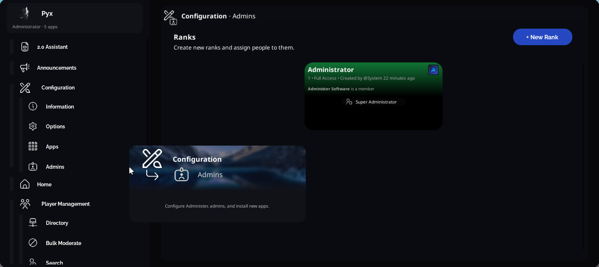
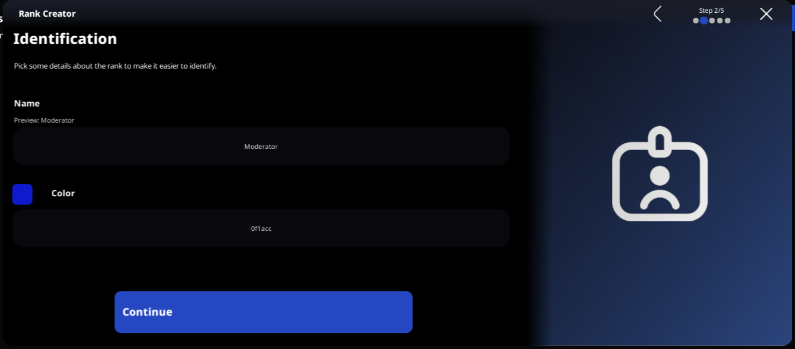
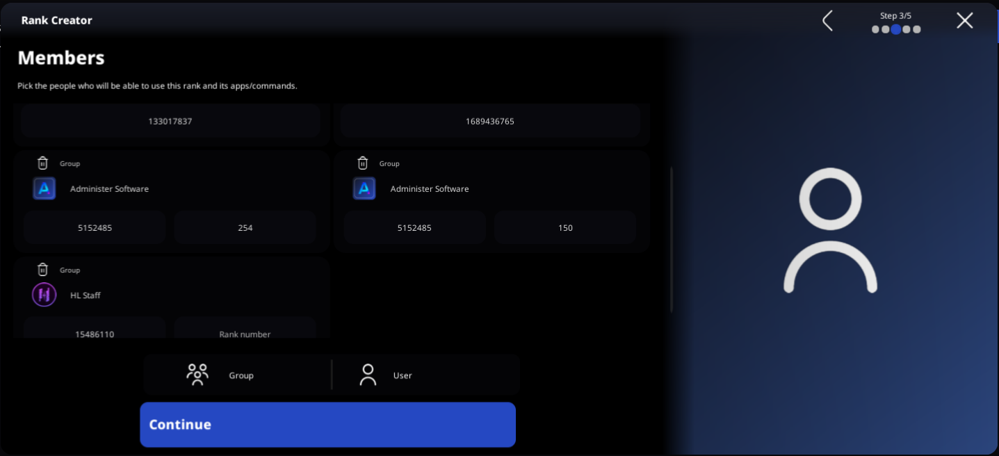
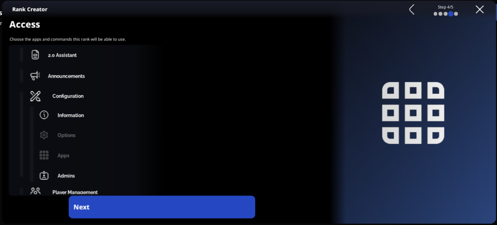
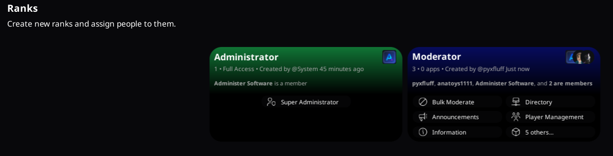

# Administrator Configuration

Administer features a unique no-code configuration setup, with ranks included.

To get started, visit the "Admins" subapp of Configuration.

To open the Rank Creator, click + New Rank and then click Next.

## Step 1. Basic Information

Administer stores ranks by their filtered name, so names must be unique. Optionally, you can include a HEX color code to make it easier to identify ranks.

## Step 2. Members

This is where you tell Administer who belongs to a rank. One person can only belong to one rank at a time. You may add one group as many times as you would like as long as the Rank ID is unique. However, rank IDs are not required. If the field is left blank, every user of a group will be able to access the rank (useful for staff groups.)

To add a new member, simply click the Group and User buttons at the bottom. 

For example, in the below image shows two users and a group with many ranks.

## Step 3. Access

Unlike traditional admin panels, Administer does not have static permissions (can ban, can kick, can audit, ...). Instead, you can control which apps and sub-apps a rank can access, along with individual commands in the soon future. 

To prohibit the use of an app or command, simply click it. Once the entry turns grey, that means it's disabled and cannot be used by the newly created rank. Please note that you will only be able to add apps that your rank has access to. 

When an app or command is installed, this rank will not automatically get it. A super admin must go into the game and edit the rank to allow for the new app if required.

As soon as you click "Next" on the Access page, you're done! The rank will be created and Administer will do a scan in every server to automatically rank anybody who is now an admin. If you followed along, your ranks page will now look like this:

Congrats! You just made your first admin rank.
