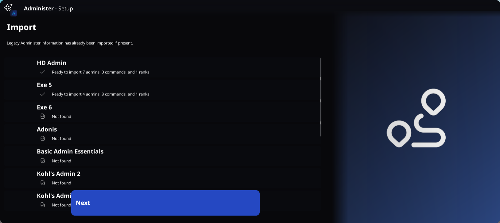
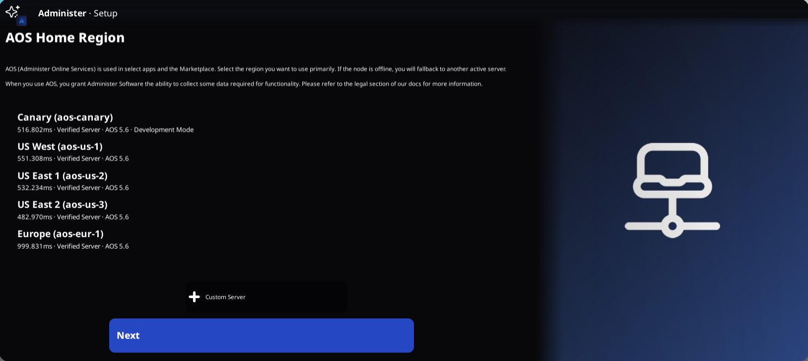

# Initial Configuration

Administer is very easy to set up and features a zero-code configuration process.

## Setup Assistant

When running Administer for the first time, you will be greeted with the Setup Assistant. This is an app which we've made to help simplify the transition process to Administer.

### Step 1. Importing

The first step in the setup process is optionally importing from other systems. While in this screen, you may click on admin systems to import available features (such as commands, admins, and ranks.)

### Step 2. AOS

We have [many AOS instances](/AOS/information/nodes.md) that you can select from. On this stage, you can select the primary instance that you would like to use, or you can link a custom one by clicking "+ Custom Server". When you primary server is offline, we'll have you fall over to an online instance with the best available latency.

### Step 3. Settings

From this menu, you can select from a curated list of options that you may want to change instantly. However, you can always change settings at any point under the Configuration subapp.

### Step 4. Guided Tour

If you're interested in learning more about how to use Administer, you can go on a guided tour right from the Setup Assistant. You'll learn how to edit widgets, use the Marketplace, and see other Configuration functions.

And you're done! Administer is now fully configured and ready for usage. 
