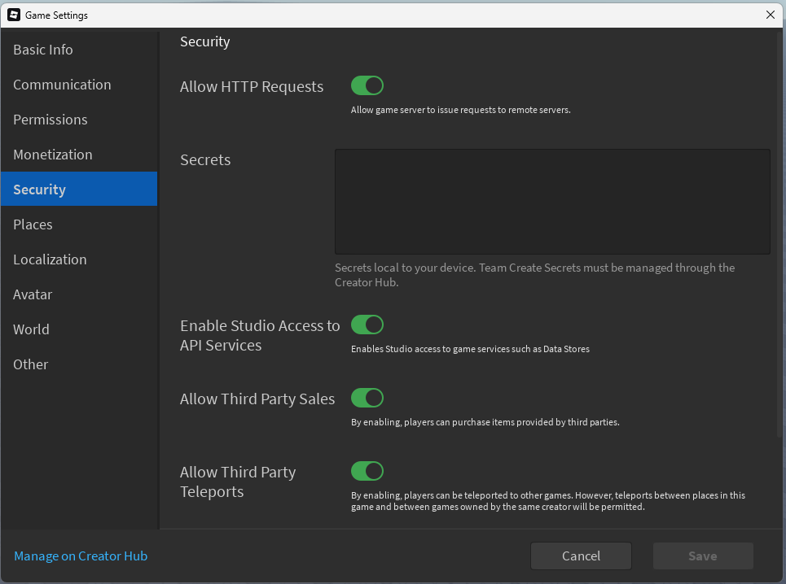

# Installation

::: info
When using Administer, it is highly recommended to join our [discord server](https://to.admsoftware.org/discord) for support, announcements, developer updates and more!
:::

Administer is ready to go out of the box.
Simply place [the model](https://create.roblox.com/store/asset/127698208806211/Administer) in the [ServerScriptService](https://create.roblox.com/docs/reference/engine/classes/ServerScriptService) and you're good to go!

::: danger IMPORTANT
Administer REQUIRES "Allow HTTP Requests" and "Enable Studio Access to API Services" in order to boot.

Additionally, some plugins and additional features may require "Allow Third Party Sales" and "Allow Third Party Teleports".

These can all be enabled in Game Settings -> Security

:::

To ensure the installation is complete, run a test server, wait a few moments as it may take some time for Administer to load for the first time, and you should see a prompt from Administer on the bottom right of the screen. 

The default keybind to bring up the Administer UI on desktop is F2. On mobile, you have to swipe from the right screen edge inwards to the center. On both platforms, you may type /adm to open the panel. 

However, if first-time setup is not completed, Administer will automatically pop up and prompt you to complete setup.

Congrats! Administer is now installed. You may continue to [initial configuration.](./initialConfig)
