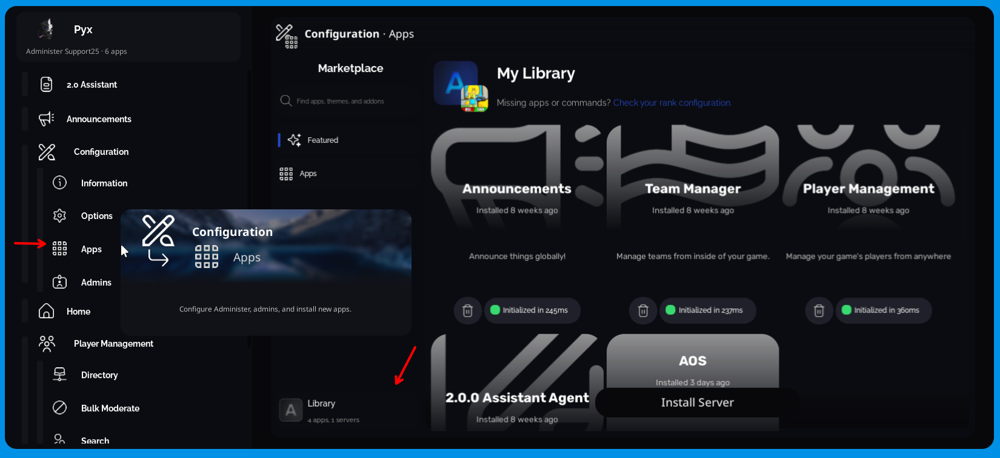

# Administer FAQ

If you have a question about Administer, be sure to check here as it may have the answer to your question. For questions about AOS, please see the [AOS FAQ.](/AOS/information/faq)

## How well is Administer tested?

Every release, our QA team thoroughly tests every build. When you use the production branch, rest assured that there are going to be no issues impacting normal usage.

## How well does Administer scale?

We have a few partnered games with high CCU counts to help us ensure build quality. In one of said games, the `Loader` script uses 1.2MB, and the Client runner uses 268KB. Player Management is using 2.88KiB in the memory store while our quota is ~370Kb.

## When I join the game for the first tine, F2 does not work.

First-time setup is a long process and may take a few seconds to complete. If you are migrating from an old Administer version, this process could take up to a minute depending on how many ranks you had. If the issue persists, first ensure you are in Studio. Then, if you *still* cannot open the panel despite seeing successful logs, open a ticket.

## When I launch Administer, I get a HTTPService is not enabled error!

Please ensure HttpService is enabled on your game. If it isn't, AOS will not be reachable.

## I launched Administer in studio, see successful log messages, but I don't see a notification and my keybind doesn't work.

Ensure that Sandbox Mode (sudo) is enabled in Settings.

## My selected official AOS Instance is offline!

Please keep checking the [official statuspage.](https://status.admsoftware.org). We are notified of outages automatically and will do our best to resolve the issue as soon as possible. However, Administer should automatically fail over to another instance in the meantime (whichever has the best latency to the current server).

## How do I delete a rank?

As of the time of writing, it is not possible to delete a rank. However, you may remove its admins, effectively disabling it. We are working to add a delete button soon.

## Where are my installed apps?

Visit the "Library" tab of the Marketplace.

## Administer loaded into my native language, but a lot of strings are in English or are missing!

Locales are a beta feature and are not complete yet. While we have basic support, the interface is still mostly English. 

If you have the time, please log into the Administer Translator Portal weblate to contribute.
https://translate.admsoftware.org

## How do I open the panel on mobile?

You need to swipe from the right side of your screen inwards. If that doesn't work, you can use the `/adm` command to open the panel, then change your "mobile open gesture" setting to be larger.

## How do I close the panel on desktop without using F2?

Hover over the topbar and then right and left click at the same time.

## Why is x named after Administer Software and not Administer?

Administer Software is the group behind Administer and related products. The name of our group is not simply "Administer" to avoid confusion (names like "Administer AOS" make sense but if we release a webpanel under a far different name it would confuse people).
