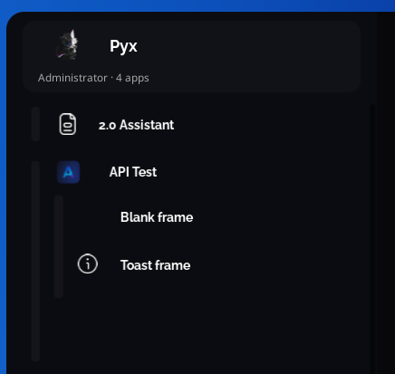
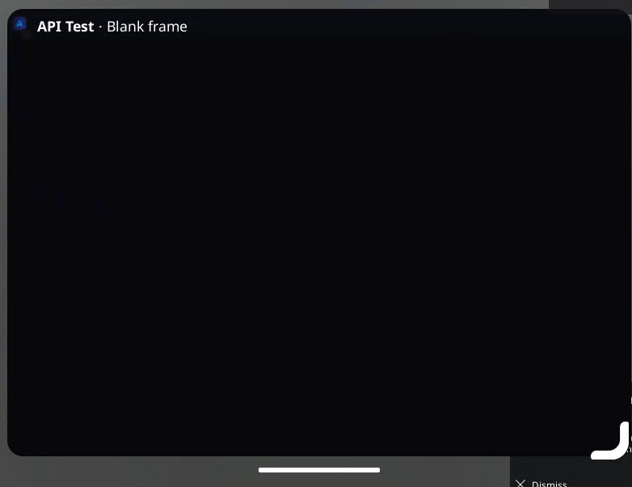
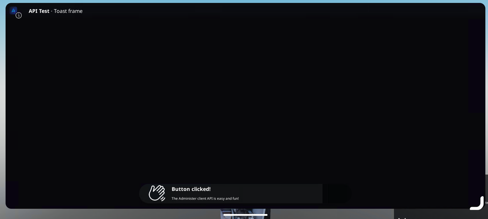
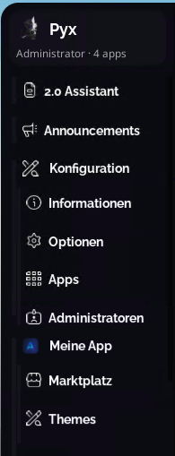

# Client Quickstart Guide

The Administer Client API works a little different than the server - but it's still straightforward.

Unlike the server, there are no standard formats or initializers at the moment. At **runtime**, your script or frame is placed inside `PlayerGui.AdministerMainPanel.Main`. 

However, the location of an app's main frame is **not static at any point**. Apps may be pulled and relocated for the app drawer animation (relocated to `Main.AppDrawer.AppDrawerCover`), popped out apps (relocated to `AdministerMainPanel`), and more. should not be using relative locations for anything (Administer modules, template locations, etc). 

With that being said, the proper way to require Administer modules is like so:

```luau
--// Get the client
local AdministerClient = game.Players.LocalPlayer.PlayerGui:FindFirstChild("AdministerMainPanel", true).Client

--// Now you can freely access modules and libraries
local Shimmer = require(AdministerClient.Libraries.Shime)
local Frontend = require(AdministerClient.Modules.Frontend)
```

And you're done! You can now do whatever you want with client APIs. However, we'll use this guide for a guide into some important topics.

## Panel Buttons

If you want to create a panel button, you must first import the [Apps](/v2/client/apps) module.

```luau
local Administer = game.Players.LocalPlayer.PlayerGui:FindFirstChild("AdministerMainPanel", true).Client.Modules

local Apps = require(Administer.Apps)
```

Now that you have it imported, you can use the [AddAppDrawerButton](/v2/client/apps#apps-addappdrawerbutton) method to register your button. For this tutorial, we'll register a multi-stack button, but making one with one icon is just as easy and you can find code examples in the [Apps](/v2/client/apps) documentation.

Simply call the method with our parameters and we're good!

```luau
Apps.AddAppDrawerButton({
    AppName = "API Test",
    Description = "Hello world!",
    Icon = "rbxassetid://116599744136879",
    ButtonID = "APITestButton",

    SubIcons = {
        {
            Name = "Blank frame",
            Icon = "rbxassetid://15029348417",
            Frame = Instance.new("Frame"),
            ButtonID = "BlankFrame"
        },
        {
            Name = "Toast frame",
            Icon = "rbxassetid://14919001252",
            Frame = Instance.new("Frame"),
            ButtonID = "ToastButton",
            Click = function()

            end
        }
    }
})
```

Now let's join the game, and we should see this!


If we click both of them, they correctly come up blank.


## Toasts/Administer UIs

Now, what if you want to make a Toast? We have a full guide on [user interfaces](/v2/help/interfaces), so this portion is going to be minimal.

First, import the [Frontend module](/v2/client/frontend):
```luau
local Frontend = require(Administer.Frontend)
```

Now, we can revise our button config to have the call for "Toast frame":

```luau
Apps.AddAppDrawerButton({
    AppName = "API Test",
    Description = "Hello world!",
    Icon = "rbxassetid://116599744136879",
    ButtonID = "APITestButton",

    SubIcons = {
        {
            Name = "Blank frame",
            Icon = "rbxassetid://15029348417",
            Frame = Instance.new("Frame"),
            ButtonID = "BlankFrame"
        },
        {
            Name = "Toast frame",
            Icon = "rbxassetid://14919001252",
            Frame = Instance.new("Frame"),
            ButtonID = "ToastButton",
            Click = function()
                Frontend.Toast({
                    Text = "Button clicked!",
                    Subtext = "The Administer client API is easy and fun!",
                    Icon = "rbxassetid://16105499426",
                    Timeout = 10
                })
            end
        }
    }
})
```

Now, when we run the script and click the "Toast frame" button, a toast appears!



## Utilities

For a little bit extra, we can remove the hardcoded icons and strings by using Utilities APIs for translations and icons. Now, let's import the [Utilities](/v2/client/utilities) module:
```luau
local Utils = require(Administer.Utilities)
```

Now let's revise the call once again, implementing translations and icons while renaming our sub-apps to "Marketplace" and "Themes":

::: danger
It is very bad practice to translate Button IDs. They are meant to stay static and should not change based on languages.
:::

```luau
Apps.AddAppDrawerButton({
    AppName = Utils.Translate("Configuration.Marketplace.MainMarketplace.Content.Template.AppName"),
    Description = Utils.Translate("Configuration.InfoPage.VersionDetails.Credit"),
    Icon = Utils.Icon("administer"),
    ButtonID = "APITestButton",

    SubIcons = {
        {
            Name = Utilities.Translate("Configuration.Marketplace.Header.Head"),
            Icon = Utilities.Icon("shop"),
            Frame = Instance.new("Frame"),
            ButtonID = "BlankFrame"
        },
        {
            Name = Utilities.Translate("Configuration.Marketplace.Header.Themes"),
            Icon = Utilities.Icon("pencil-paintbrush"),
            Frame = Instance.new("Frame"),
            ButtonID = "ToastButton",
            Click = function()
                Frontend.Toast({
                    Text = "Button clicked!",
                    Subtext = "The Administer client API is easy and fun!",
                    Icon = "rbxassetid://16105499426",
                    Timeout = 10
                })
            end
        }
    }
})
```

Now, when we join the panel, we get to see the new buttons in the user's selected language!



Congrats! You just made a new app using many Administer client modules. There's a lot more not covered in this guide, so we recommend you look through every module to find functions you might want to use or need to hook into.
