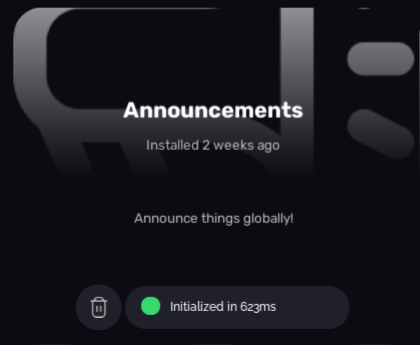

# RichConfig

RichConfig is a property of [Apps](/v2/server/apps) which is used for bootstrapping apps. It returns a table which is used for Administer knowing what to do with your app and identifying it.

You can construct a new object like this:

```luau
local Apps = require("/Administer/Loader/Modules/Apps")

local MyConfig = Apps.InvocationAPI.RichConfig()
```

It will return the following blank RichConfig object:

```lua
{
    AppMeta = {
			Name = "Default App",
			Icon = "",
			Version = "0",
			Description = "This is an application which is improperly configured."
		},

		Dependencies = {
			Administer = "2.0.0",
			SettingsAPI = "1.0",
			AppPlatform = "2.0",

			AdministerModules = {},

			IsAdministerVersionRelevant = true
		},

		TextCommands = {},
		State = {}
}
```

## AppMeta

This section has the metadata for your app. It doesn't change anything functionally, only how it is displayed in the Library:



## Dependencies

The Dependencies section tells Administer how your app should run. Please refer to the following table.

| Property                    | Purpose                                                                         | Layout     |
|-----------------------------|---------------------------------------------------------------------------------|------------|
| Administer                  | Administer versions your app will run on                                        | StdVersion |
| SettingsAPI                 | Which version of the SettingsAPI will your app run with?                        | StdVersion |
| AppPlatform                 | App API version required for your app to build                                  | StdVersion |
| AdministerModules           | Administer modules which will be passed through to your MainHook                | See below  |
| IsAdministerVersionRelevant | Whether or not Administer being out of date will prevent your app from starting | boolean    |

