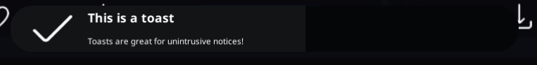
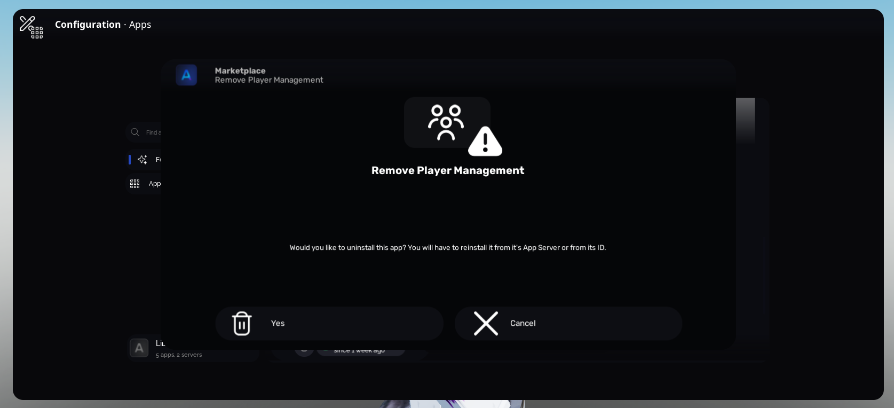
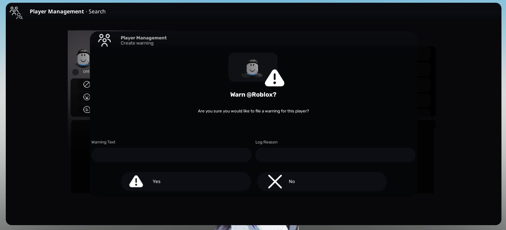
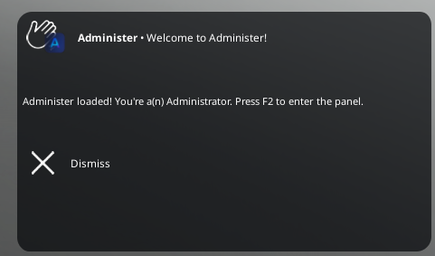

# Interfacing with the End User

Administer's core libraries provide many ways to provide data and options to the user of your apps.

## Toast
[API Reference](/v2/client/frontend#frontend-toast)

### Intended Purpose
Notices mostly, anything that is good for the user to know but does not require their attention



::: code-group

```luau [Example]
Frontend.Toast({
    Timeout = 5
    Icon = Utilities.Icon "check-plain",
    Text = "This is a toast",
    Subtext = "Toasts are great for unintrusive notices!",
    OnClick = function()
        print("The toast has been clicked!")
    end
})
```

:::

## Popup

[API Reference](v2/client/frontend#frontend-popup-new)

### Intended Purpose
Long notices, yes/no prompts, inputs. Very versatile. 




::: code-group

```luau [Example]
Frontend.Popup.new(
    {
        Name = "Player Management",
        Subheader = "Create warning",
        Icon = Utilities.Icon "users"
    },
    {
        Primary = PlayerBasic.Photo,
        SubIcon = Utilities.Icon "warning-filled"
    },

    `Warn @{PlayerBasic.Username}?`,
    "Are you sure you would like to file a warning for this player?",
    {
        {
            Text = "Yes",
            Icon = Utilities.Icon "warning-filled",
            Callback = function(Close, Text)
                print(Remotes.ServerComm:InvokeServer("WarnPlayer", {
                    TargetID = PlayerID,
                    Warning = Text[1]
                }))

                Close()
                LoadPlayer(PlayerID, ServerJobID)
            end
        },
        {
            Text = "No",
            Icon = Utilities.Icon "x",
            Callback = function(Close)
                Close()
            end
        }
    },
    {
        {
            HeaderText = "Warning Text"
        },
        {
            HeaderText = "Log Reason"
        }
    }
)
```

:::

## Notification
[API Reference (server)](/v2/server/utilities#utilities-newnotification) &bullet; [API Reference (client)](/v2/client/utilities#utilities-newnotification)

### Intended Purpose
Anything that does not require attention inside of the panel. Best for use cases where you cannot access Client APIs because it is on both stacks.



::: code-group

```luau [Example]
Util.NewNotification(
    Player,
    "Welcome to the game! Enjoy your stay.",
    "Welcome!",
    "rbxassetid://16105499426",
    15,
    nil,
    {}
)
```

:::
