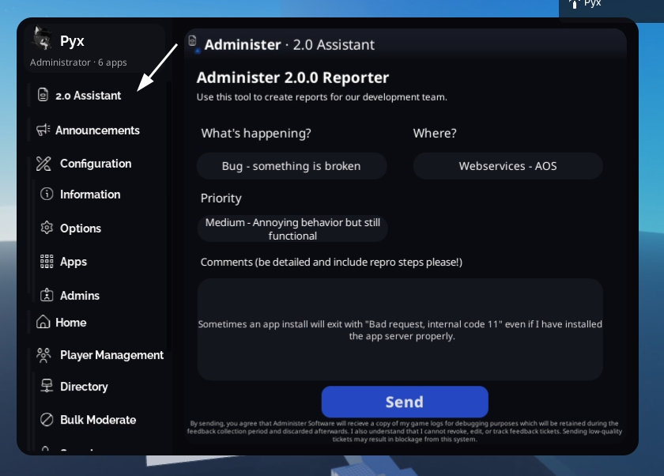

## 2.0 Public Beta Survival Guide

Thank you for installing the 2.0.0 public beta! Before you continue, there are a few things you should know.

First, the AOS database is on `administer_dev`, not `administer`. Any ratings or app installations may not be carried over to the final 2.0 public build. There are also no API docs or tutorials at the moment - we are working on them! They'll be released alongside the public 2.0.0 release.

We are currently running off a raspberry pi (which is still tracked at https://status.admsoftware.org under "AOS Canary"), so please excuse any slowness in AOS. Using other AOS nodes will not be possible at the moment because they are hooked into the production database which uses a different schema than dev uses. When we do a full release our network of 5 nodes will be fully in use, so please do not report API slowness.

When you join your game for the first time, Administer should auto-migrate. This will take anywhere from 15 seconds to a couple of minutes depending on how many ranks and admins you have added.

::: danger IMPORTANT
ALL USERS WILL BE GIVEN "SUPER ADMIN", MEANING THEY HAVE ACCESS TO EVERY APP!! This is because there is no good system to migrate old Administer ranks to new one, so we decided this was the best option.
:::

If you don't want that, you can delete the ranks and create new ones using the new permission system.

### Missing features

1. Marketplace search
2. First-time setup assistant (onboarding)
3. Settings (entirely)
4. Rank Editing

### Known Issues

You can find the Known Issues list on the Trello board: https://trello.com/b/GA5Kc0vB/administer

### Reporting Issues

Simply launch the "2.0 reporter" app from within the panel.

And that's it! Let us know if you have any other questions or concerns - our support team will do our best to assist.
